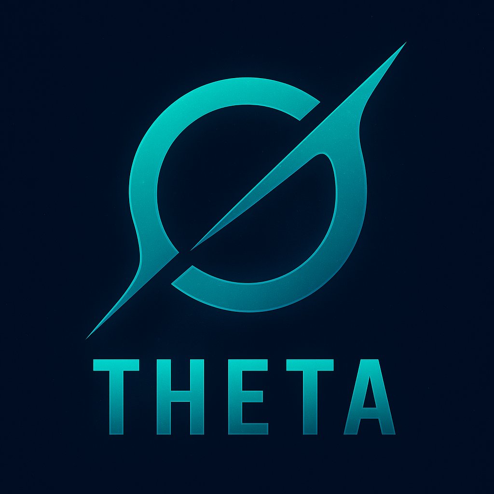

# Theta

  

---

## Overview

**Theta** is a next-generation **Web3 protocol layer** built in Rust, designed to connect decentralized infrastructure across blockchain, mesh, and traditional networks.

It acts as the **foundation layer** for the Orbit Network, bridging secure overlay communication, node identity, and cryptographic routing under a zero-trust model.

Theta integrates **QUIC-based transport**, **cryptographic identity**, and **modular consensus** for scalable, verifiable data exchange across heterogeneous environments.

---

> **Goal:** Deliver a future-ready foundation that merges blockchain-grade trust with Internet-grade performance.
---

## 🌐 Architecture

Theta introduces a modular, next-generation networking protocol built in Rust — bridging traditional TCP/IP with decentralized, blockchain-backed transport layers. It is designed to enable **trustless, cryptographically verifiable communication** between nodes, services, and blockchains.

**Core Components**

* **Theta Core** – the main Rust engine managing peer sessions, cryptography, and routing.
* **Orbit Layer** – the decentralized overlay network for relaying authenticated packets.
* **Crypto Primitives** – Rust-based key exchange, signature, and zk-verification modules.
* **Zero Trust Framework** – every request, route, and connection is validated end-to-end.

---

## 🧠 Vision

Theta aims to unify modern networking and blockchain principles into one cohesive stack:

* **Web3-Native Transport** – blockchain-aware addressing and routing.
* **QUIC/HTTP3 Foundation** – built for performance and global interoperability.
* **Programmable Layers** – extend the stack for DeFi, storage, or identity routing.
* **Interoperability** – bridge to other Rust and Zig projects like Ghostchain and Ghostplane.

Theta is the **connective tissue of decentralized infrastructure** — fast, resilient, and verifiable.

